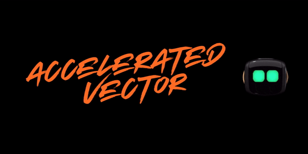

<!-- PROJECT SHIELDS -->
[![Contributors][contributors-shield]](https://github.com/rhysdg/ollama-voice-jetson/contributors)
[![Apache][license-shield]][license-url]
[![LinkedIn][linkedin-shield]][linkedin-url]

<!-- PROJECT LOGO -->
<br />
  <h3 align="center"> Accelerated Vector</h2>
  <p align="center">
     A wire-pod enabled 3D animation and accelerated machine learning suite for Vector
     <br />
    <a href="https://github.com/rhysdg/accelerated-vector/wiki"<strong>Explore the docs »</strong></a>
    <br />
    <br />
    
    <br />
    <br />
    <a href="https://github.com/rhysdg/accelerated-vector/issues">Report Bug</a>
    .
    <a href="https://github.com/rhysdg/accelerated-vector/issues">Request Feature</a>
  </p>
</p>

<!-- TABLE OF CONTENTS -->
## Table of Contents

* [About the Project](#about-the-project)
  * [Built With](#built-with)
  * [The Story so Far](#the-story-so-far)
* [Getting Started](#getting-started)
  * [Prerequisites](#prerequisites)
  * [Scripts and Tools](#scripts-and-tools)
  * [Supplementary Data](#supplementary-data)
* [Vector SDK Connectivity](#vector-sdk-connectivity)
* [Proposed Updates](#proposed-updates)
* [Contact](#contact)

<!-- ABOUT THE PROJECT -->
## About The Project

### Built With

* [Blender 4](https://www.blender.org/)
* [Onnxruntime](https://onnxruntime.ai/)


### The Story So Far

**Coming soon**

In the meantime check out the ongoing youtube series here:

[](https://www.youtube.com/watch?v=OQMk-K9NM3w&list=PLhjBVq157J6p6ea1Z1D-D8fh4uDna5mnl "Everything Is AWESOME")

<!-- INSTALLATION -->
## Installation

The Blender addon lives in the `vector_animation/` directory. Two ways to install:

### Option 1: Symlink (development)

Link the addon folder into Blender's user addons directory so changes are picked up immediately:

```bash
# Blender 5.x (adjust version number as needed)
mkdir -p ~/.config/blender/5.1/scripts/addons
ln -s /absolute/path/to/accelerated-vector/vector_animation \
      ~/.config/blender/5.1/scripts/addons/vector_animation
```

Then in Blender: **Edit → Preferences → Add-ons** → search for *"Servo"* → enable the checkbox.

After editing any addon file, reload scripts with <kbd>F3</kbd> → *"Reload Scripts"* or disable/re-enable the addon in Preferences.

### Option 2: Zip (distribution)

Zip the addon folder and install through Blender's Preferences:

```bash
cd /path/to/accelerated-vector
zip -r vector_animation.zip vector_animation/
```

Then in Blender: **Edit → Preferences → Add-ons → Install from Disk…** → select `vector_animation.zip` → enable the checkbox.

<!-- GETTING STARTED -->
## Getting Started:

**coming soon**

  
## Vector SDK Connectivity

This project uses [wire-pod](https://github.com/kercre123/wire-pod) (running on a Raspberry Pi) as a drop-in replacement for Vector's cloud servers. The animated rig and SDK scripts connect to Vector directly over WiFi.

### Network Architecture

```
┌──────────────────┐   gRPC (:443)   ┌──────────────┐
│  Laptop (Blender) │───────────────→│  Wire-pod     │
│  with addon       │  IP: wirepod   │  (Raspberry   │
└───────────────────┘                │   Pi)         │
                                     └──────┬───────┘
┌──────────────────┐   gRPC (:443)          │
│  Jetson          │─────────────────────→   │
│  (parent robot   │  IP: wirepod            │
│   controlling    │                  gRPC (:443) built-in
│   Vector)        │                         │
└──────────────────┘                         ↓
                                      ┌──────────────┐
                                      │  Vector Robot │
                                      │  192.168.0.x  │
                                      └──────────────┘
```

- **Laptop** runs the Blender addon — connects to Wire-pod via gRPC (:443) to send live servo positions.
- **Jetson** runs the parent robot controller — connects to Wire-pod via gRPC (:443) for higher-level Vector control.
- Both use `anki_vector.Robot(ip=...)` pointing to the **Wire-pod server's IP** (not Vector's IP). The SDK routes to Vector through Wire-pod automatically.
- **Vector** connects to Wire-pod autonomously over its built-in gRPC client.
- **Wire-pod web UI** is on port 8080 (e.g. accessed via the Jetson's socat forwarder).

> **In the addon**: the **"Wire-pod IP"** field in the Live Mode popover expects the Wire-pod server's address (e.g. `192.168.0.12`), not Vector's address.

### Finding Vector's Current IP

Vector uses DHCP and the lease can change (e.g. `192.168.0.197` → `192.168.0.15`). Wirepod keeps a record of the last known IP:

```bash
# On the wirepod server (Pi)
cat /home/vector/wire-pod/chipper/jdocs/botSdkInfo.json
```

Look for:
```json
{"esn":"004036df","ip_address":"192.168.0.x","guid":"...","activated":true}
```

You can also scan the subnet for Vector's open gRPC port:

```bash
nmap -p 443 192.168.0.0/24 2>/dev/null | grep -B2 open
```

### Blender Addon Environment

The Blender addon runs inside Blender's **bundled Python**, not your system Python. This means:

- **Blender's Python binary** (varies by install method):
  - Snap: `/snap/blender/7480/5.1/python/bin/python3.13`
  - Other: `<blender_install>/5.1/python/bin/python3.13`
- **Snap confinement** hides `~/.local/lib/python3.13/site-packages` (user site-packages) from Blender's `sys.path`. The addon works around this by injecting the user site-packages path at startup — so you can `pip install --user` packages and they'll be visible to the addon.
- The "Install Dependencies" button inside Blender runs:
  ```bash
  <blender-python> -m pip install --user -r vector_animation/requirements.txt
  ```

#### Required packages

```
pyserial              # serialport live mode
websocket-client      # WebSocket live mode
wirepod_vector_sdk    # Wire-pod SDK (provides the `anki_vector` module)
```

> **Important**: Use `wirepod_vector_sdk`, **not** the upstream `anki-vector` package. The official `anki-vector` has protobuf version incompatibilities with the bundled libraries and won't work with Wire-pod.

#### Quick SDK test (using Blender's Python)

```bash
/snap/blender/7480/5.1/python/bin/python3.13 \
    -c "import anki_vector; print('OK:', anki_vector.__file__)"
```

You can also run the SDK's configuration tool:

```bash
/snap/blender/7480/5.1/python/bin/python3.13 -m anki_vector.configure
```

### SDK Configuration (`sdk_config.ini`)

Each SDK client machine stores credentials in `~/.anki_vector/sdk_config.ini`:

```ini
[004036df]
cert = /home/user/.anki_vector/Vector-K1F3-004036df.cert
ip = 192.168.0.x                 ← must match Vector's current IP
name = Vector-K1F3
guid = <session-guid>            ← must match wirepod's session
```

#### Updating the IP

If Vector's DHCP lease changes, update the `ip` field on every client machine.

#### Updating the GUID

When wirepod pairs with Vector, it creates a new session and invalidates any previous SDK client GUID. The current valid GUID is stored in wirepod's `botSdkInfo.json`:

```bash
# On the Pi, read the current GUID
cat /home/vector/wire-pod/chipper/jdocs/botSdkInfo.json
# Returns: {"global_guid":"...","robots":[{"esn":"004036df","ip_address":"...","guid":"<CURRENT_GUID>","activated":true}]}
```

Copy the `<CURRENT_GUID>` value into every client's `sdk_config.ini`.

### Quick Test

Use Blender's Python (the system `python3` won't see the `anki_vector` module):

```bash
/snap/blender/7480/5.1/python/bin/python3.13 -c "
import anki_vector
with anki_vector.Robot() as r:
    print('Connected!')
"
```

If you see `Connected!`, the SDK can talk to Vector.

> **In the addon's Live Mode popover**, the **"Wire-pod IP"** field expects your Wire-pod server's IP address (not Vector's IP). The `wirepod_vector_sdk` handles routing to Vector through Wire-pod automatically.

### Configuring Bones for Vector SDK

Each bone that should drive a Vector motor needs a unique **Servo ID** and a **Vector Motor** type set in the Bone Properties panel. A helper script automates this:

```bash
# configure the opened .blend (run from the project root)
blender blender_model/accelerate_vector.blend --background --python scripts/configure_servos.py
```

The script assigns the following defaults (edit `scripts/configure_servos.py` to change them):

| Bone | Armature | Servo ID | Vector Motor |
|---|---|---|---|
| `Head` | Armature | 1 | HEAD |
| `Lift` | Armature.001 | 2 | LIFT |
| `Left_Wheel` | Armature.002 | 3 | LEFT_WHEEL |
| `Right_Wheel` | Armature.003 | 4 | RIGHT_WHEEL |
| `Body_Turn` | Armature.004 | 5 | BODY_TURN |

To reconfigure after re-exporting the model, just run the same command again.

### Known Quirks

- **Vector won't drive while on the charger.** Take it off the base before calling `drive_straight`, `turn_in_place`, etc.
- **Wirepod re-pairing invalidates old SDK GUIDs.** After re-pairing wirepod, you must update the GUID in every `sdk_config.ini` (see above).
- **The SDK uses gRPC over TLS on port 443.** Nmap with `-sT` or a raw TCP connection test works, but ICMP ping may be blocked on some firmware versions.
- **`r.disconnect()` may crash** with `AttributeError: 'NoneType' object has no attribute 'close'` if vision was never initialised. Prefer the context manager (`with anki_vector.Robot() as robot:`) to avoid this.

### Troubleshooting Checklist

| Symptom | Likely Cause | Fix |
|---------|-------------|-----|
| `Destination Host Unreachable` | Vector's DHCP lease changed | Update `ip` in `sdk_config.ini` |
| `VectorUnauthenticatedException: 401` | GUID invalidated by wirepod re-pair | Copy GUID from wirepod's `botSdkInfo.json` |
| `grpc.FutureTimeoutError` | Wrong IP, or Vector not on WiFi | Check IP with wirepod or `nmap` |
| Connection succeeds but robot doesn't move | On charger or battery too low | Take off charger, check battery with `r.get_battery_state()` |


## Customisation:

- **Coming soon**


### Notebooks


1. **Coming soon**


### Testing

 - CI/CD will be expanded as we go - all general instantiation tests pass so far.

### Models & Latency benchmarks


### Similar projects

- Pending

<!-- PROPOSED UPDATES -->
## Latest Updates

**coming soon**

<!-- PROPOSED UPDATES -->
## Future updates
- facial expressions and sound dropdown during animation
- onnxruntime based accelereated machine learning.
-live cam with ML plugin

<!-- Contact -->
## Contact
- Project link: https://github.com/rhysdg/accelerated-vector
- Email: [Rhys](rhysdgwilliams@gmail.com)


<!-- MARKDOWN LINKS & IMAGES -->
[build-shield]: https://img.shields.io/badge/build-passing-brightgreen.svg?style=flat-square
[contributors-shield]: https://img.shields.io/badge/contributors-2-orange
[license-shield]: https://img.shields.io/badge/License-GNU%20GPL-blue
[license-url]: LICENSE.txt
[linkedin-shield]: https://img.shields.io/badge/-LinkedIn-black.svg?style=flat-square&logo=linkedin&colorB=555
[linkedin-url]: https://www.linkedin.com/in/rhys-williams-b19472160/
