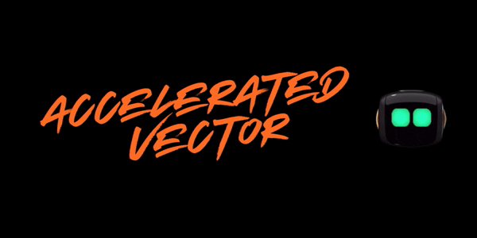

<!-- PROJECT SHIELDS -->
[![Contributors][contributors-shield]](https://github.com/rhysdg/ollama-voice-jetson/contributors)
[![Apache][license-shield]][license-url]
[![LinkedIn][linkedin-shield]][linkedin-url]

<!-- PROJECT LOGO -->
 
  <h3 align="center"> Accelerated Vector</h2>
  

     A wire-pod enabled 3D animation and accelerated machine learning suite for Vector
      
    <a href="https://github.com/rhysdg/accelerated-vector/wiki"<strong>Explore the docs »</strong></a>
     
     
    
     
     
    <a href="https://github.com/rhysdg/accelerated-vector/issues">Report Bug</a>
    .
    <a href="https://github.com/rhysdg/accelerated-vector/issues">Request Feature</a>
  

<!-- TABLE OF CONTENTS -->
## Table of Contents

* [About the Project](#about-the-project)
  * [Built With](#built-with)
  * [The Story so Far](#the-story-so-far)
* [Getting Started](#getting-started)
  * [Prerequisites](#prerequisites)
  * [Scripts and Tools](#scripts-and-tools)
  * [Supplementary Data](#supplementary-data)
* [Proposed Updates](#proposed-updates)
* [Contact](#contact)

<!-- ABOUT THE PROJECT -->
## About The Project

### Built With

* [Blender 4](https://www.blender.org/)
* [Onnxruntime](https://onnxruntime.ai/)

### The Story So Far

**Coming soon**

<!-- GETTING STARTED -->
## Getting Started:

**coming soon**

  
## Customisation:

- **Coming soon**

### Notebooks

1. **Coming soon**

### Testing

 - CI/CD will be expanded as we go - all general instantiation tests pass so far.

### Models & Latency benchmarks

### Similar projects

- Pending

<!-- PROPOSED UPDATES -->
## Latest Updates

**coming soon**

<!-- PROPOSED UPDATES -->
## Future updates
- facial expressions and sound dropdown during animation
- onnxruntime based accelereated machine learning.
-live cam with ML plugin

<!-- Contact -->
## Contact
- Project link: https://github.com/rhysdg/accelerated-vector
- Email: [Rhys](rhysdgwilliams@gmail.com)

<!-- MARKDOWN LINKS & IMAGES -->
[build-shield]: https://img.shields.io/badge/build-passing-brightgreen.svg?style=flat-square
[contributors-shield]: https://img.shields.io/badge/contributors-2-orange
[license-shield]: https://img.shields.io/badge/License-GNU%20GPL-blue
[license-url]: LICENSE.txt
[linkedin-shield]: https://img.shields.io/badge/-LinkedIn-black.svg?style=flat-square&logo=linkedin&colorB=555
[linkedin-url]: https://www.linkedin.com/in/rhys-williams-b19472160/
